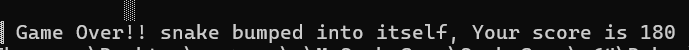
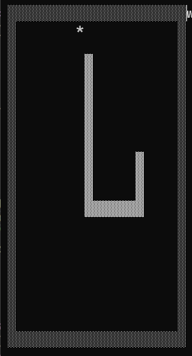

# Snake Game

This is a simple text-based Snake game written in C. The game allows the player to control the snake and grow it by eating food, while avoiding collisions with walls and itself.

## Controls

- **4**: Move left
- **6**: Move right
- **2**: Move down
- **8**: Move up

Use these keys to navigate the snake in the desired direction.

## Screenshots



## Game Features

- The snake starts as a small segment and grows longer each time it eats food.
- The game ends if the snake collides with the walls or itself.
- The player can use the number keys `4`, `6`, `2`, and `8` to move the snake left, right, down, or up, respectively.

## How to Play

1. Start the game by running the program.
2. Use the number keys to control the snake's movement.
3. Eat the food to make the snake grow longer.
4. Try to avoid hitting the walls or the snake's body.
5. The game ends when the snake collides with a wall or itself.

## Installation

1. Clone the repository to your local machine.
2. Navigate to the project directory.
3. Compile the program using a C compiler:
   ```bash
   git clone https://github.com/MalkiApplebaum/SnakeGame.git
